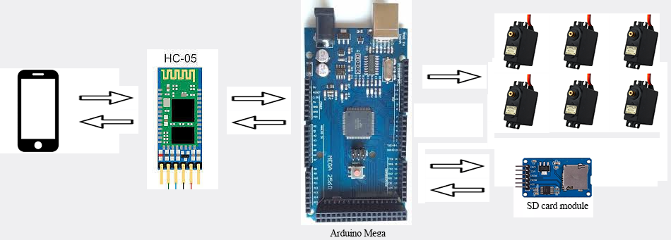
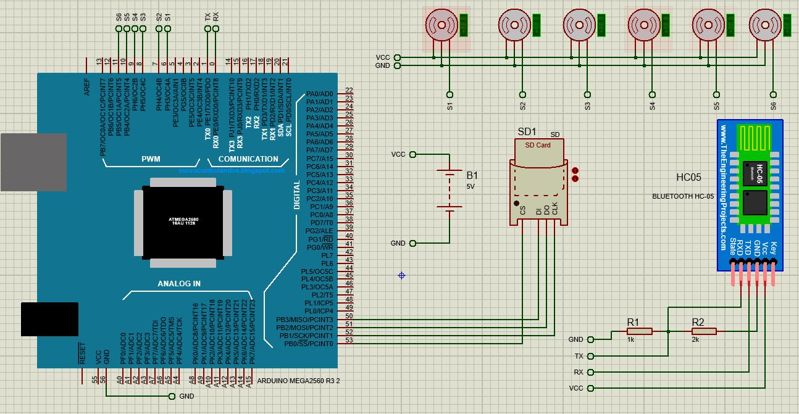

# 5 axis Trainable Robot Arm
The robot arm can be easily trained to perform actions by android app and these actions can be saved to the sd card to play what time you want.

 

## Description
This robot arm has 5 DOF (degrees of freedom) and I used a servo motor (Tower Pro mg995) to motion in every joint. To controlling servo motors I used arduino mega and it's communicating with android app via bluetooth. Android app created with Unity3D.

 

## Robot arm 3D model
This printable and open source robot arm model created by [Danny Van den Heuvel](https://github.com/danny-vdh). You can find all STL files in [6DOF ROBOT ARM](https://www.thingiverse.com/thing:2465275)  

## Circuit diagram

 

## Author
TODO:
